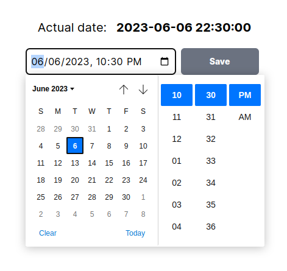

# Nextjs site with TailwindCSS for Kiriti

## Structure of components developed for the landing page
- Landing (/src/app/page.tsx)
- components
  - Hero
    - Titles
    - Ticks
    - Calendar
          
  - Checkboxes
    - Form
    - SecondSection

  - Images
    - Screens
    - Become
    
  - Bonus
    - Texts
    - DocTypeComponent (loop)
    - RunningOut
    - Become

  - Certificate

  - Mentors

  - StillNotConvinced
    - Become

  - FaqSection
    - Faq(loop)
    - Become

  - Footer
    - RunningOutFooter

## file: date.json
date.json contains the date of the event that the landing deals with, based on that date the remaining time in the page counters is calculated.

## Extra (admin section)
I built a simple interface to change the date without having to do the deploy

